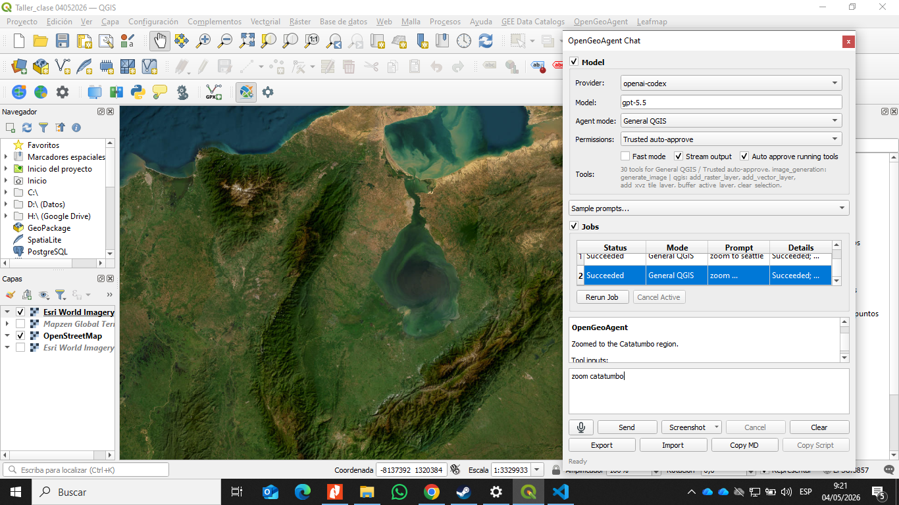
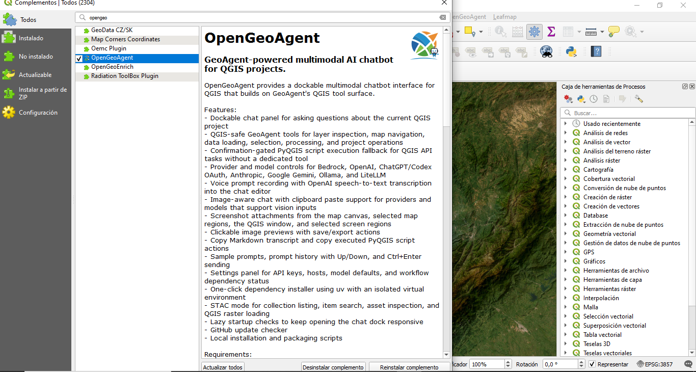
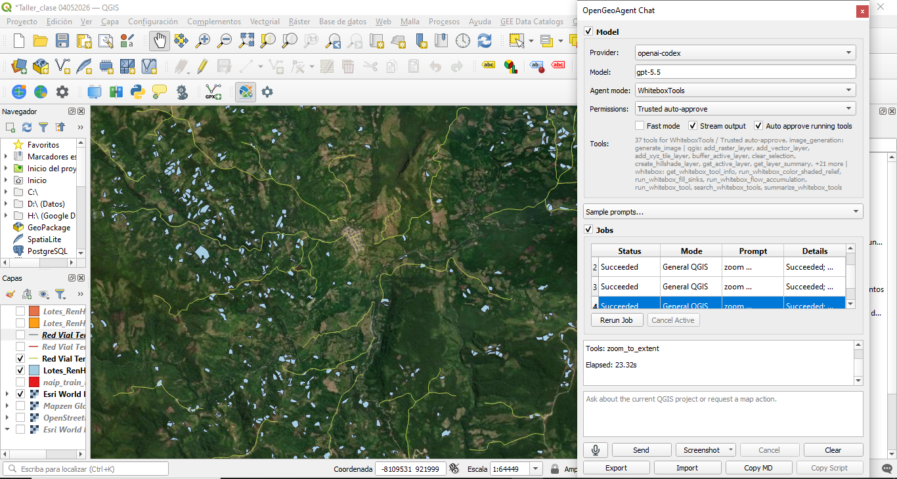
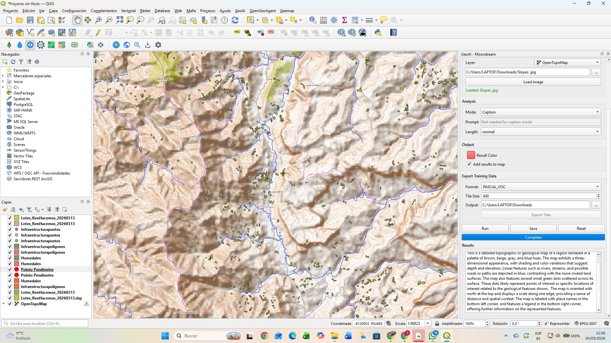
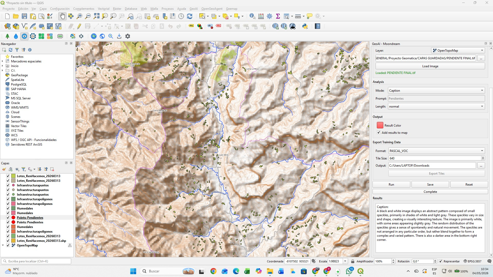

# Introducción

En Colombia, las zonas priorizadas para la sustitución de cultivos de uso ilícito presentan limitaciones estructurales relacionadas con la baja conectividad vial, lo que dificulta la comercialización de productos agropecuarios lícitos. Esta problemática impacta directamente la sostenibilidad económica de los programas de sustitución.

El presente proyecto propone el uso de Sistemas de Información Geográfica (SIG) y herramientas de análisis espacial para optimizar las rutas logísticas entre unidades productivas, centros de acopio y nodos de transformación. Asimismo, se busca identificar tramos críticos de la infraestructura vial que requieren intervención para garantizar la transitabilidad durante todo el año.

La relevancia espacial del proyecto radica en la integración de variables geográficas (pendiente, accesibilidad, cobertura del suelo, estado vial), permitiendo generar soluciones basadas en evidencia técnica que contribuyan al desarrollo territorial y a la consolidación de economías lícitas.

---

# Planteamiento del Problema

En Colombia, las zonas priorizadas para la sustitución de cultivos de uso ilícito enfrentan importantes limitaciones estructurales asociadas a la baja conectividad vial y a la deficiente calidad de la infraestructura de transporte rural. Estas condiciones restringen significativamente el acceso de los productores a mercados formales, incrementan los costos logísticos y reducen la competitividad de los productos agropecuarios lícitos, lo que debilita la sostenibilidad de los programas de sustitución.

La problemática se acentúa en territorios con condiciones topográficas complejas, alta pluviosidad y limitada inversión en infraestructura, donde muchas vías presentan deterioro, baja transitabilidad o inexistencia de conexiones eficientes entre unidades productivas, centros de acopio y nodos de comercialización. Como consecuencia, se generan tiempos de desplazamiento elevados, pérdidas en la cadena de valor y desincentivos para el desarrollo de economías legales.

A pesar del avance en el uso de herramientas geoespaciales para la planificación territorial, aún existe una limitada aplicación integrada de análisis de redes, evaluación multicriterio y datos de sensores remotos para la optimización logística en contextos rurales asociados a la sustitución de cultivos. Esta brecha técnica dificulta la identificación de rutas óptimas y la priorización de intervenciones en la infraestructura vial.

En este contexto, surge la necesidad de desarrollar un enfoque basado en Sistemas de Información Geográfica (SIG) que permita analizar de manera integral las condiciones del territorio, optimizar las rutas logísticas y apoyar la toma de decisiones para la mejora de la conectividad rural, contribuyendo así al fortalecimiento de las economías lícitas y al desarrollo territorial sostenible.

---

# Justificación

El desarrollo de este proyecto se justifica en la necesidad de fortalecer los procesos de planificación territorial y logística en zonas rurales estratégicas para la sustitución de cultivos de uso ilícito en Colombia. La mejora de la conectividad vial constituye un factor determinante para garantizar la viabilidad económica de las actividades productivas lícitas, facilitando el acceso a mercados, reduciendo costos de transporte y mejorando la calidad de vida de las comunidades.

Desde el punto de vista técnico, la integración de herramientas de Sistemas de Información Geográfica (SIG), análisis de redes y procesamiento de imágenes satelitales permite generar información precisa y actualizada sobre las condiciones del territorio. Esto posibilita la identificación de corredores logísticos eficientes, la evaluación de restricciones físicas como la pendiente o el estado de las vías, y la priorización de intervenciones en infraestructura con base en criterios objetivos y cuantificables.

En el ámbito social, el proyecto contribuye al fortalecimiento de economías lícitas al mejorar las condiciones de acceso y comercialización de productos agrícolas, lo cual es fundamental para la sostenibilidad de los programas de sustitución. Asimismo, promueve la equidad territorial al enfocar el análisis en regiones históricamente afectadas por el aislamiento geográfico y la limitada presencia institucional.

Finalmente, desde una perspectiva académica y aplicada, este trabajo aporta al desarrollo de metodologías replicables que integran análisis geoespacial y toma de decisiones en contextos rurales complejos, constituyendo una herramienta útil para entidades gubernamentales, organizaciones territoriales y proyectos de desarrollo que buscan optimizar la infraestructura y la logística en zonas rurales del país.

---

# Estado del Arte / Revisión Bibliográfica Preliminar

Diversos estudios han demostrado el potencial de los SIG y la teledetección para la planificación territorial y optimización logística. A nivel internacional, se han utilizado algoritmos de redes y análisis multicriterio para determinar rutas óptimas considerando costos, distancia y condiciones del terreno.

En el contexto colombiano:

- El uso de herramientas como ArcGIS Pro ha permitido modelar redes viales y analizar accesibilidad rural.
- Plataformas como Google Earth Engine (GEE) han sido fundamentales en el análisis de cobertura del suelo, cambios temporales y condiciones ambientales.
- Investigaciones recientes integran Modelos Digitales de Elevación (MDE) para evaluar pendientes y restricciones geomorfológicas en infraestructura vial.

Sin embargo, aún existe una brecha en la integración de estas tecnologías para apoyar directamente procesos de sustitución de cultivos, lo que justifica el desarrollo del presente proyecto.

---

# Objetivos

## Objetivo General

Optimizar las rutas logísticas para la distribución de productos agropecuarios en zonas de sustitución de cultivos mediante herramientas SIG.

## Objetivos Específicos

- Caracterizar espacialmente el área de estudio mediante la integración de información geográfica asociada a red vial, unidades productivas, centros de acopio y variables físicas del territorio.
- Evaluar las condiciones de accesibilidad y transitabilidad de la infraestructura vial existente mediante el análisis de variables como pendiente, estado de las vías y cobertura del suelo.
- Modelar la red de transporte utilizando herramientas SIG para identificar rutas óptimas entre zonas productivas y centros de acopio, considerando criterios de distancia, tiempo y costo.
- Aplicar técnicas de análisis multicriterio para la identificación y priorización de tramos críticos de la infraestructura vial que requieren intervención.
- Proponer alternativas de mejora en la infraestructura vial basadas en los resultados del análisis geoespacial, orientadas a optimizar la conectividad y eficiencia logística en el área de estudio.

---

# Área de Estudio

El área de estudio corresponde a zonas priorizadas para la sustitución de cultivos en Colombia como el Catatumbo, Ituango, Argelia o Región de Abades, donde prevalece el clima cálido y húmedo, con suelos fértiles pero con limitaciones en infraestructura vial. Estas regiones presentan una alta concentración de unidades productivas agrícolas, centros de acopio y nodos de comercialización, lo que las convierte en escenarios ideales para el análisis logístico propuesto. Su topografía es variada, con presencia de zonas montañosas y escarpadas, lo que representa un desafío adicional para la planificación de rutas y la adecuación de la infraestructura vial.

Se incluirá:

- Delimitación geográfica del área de influencia.
- Ubicación de:
  - Parcelas productivas
  - Centros de acopio
  - Infraestructura vial
- Mapa base de Colombia y zoom al área específica de análisis.

{width=100%}

{width=100%}

{width=100%}

---

# Fuentes de Datos

El desarrollo del proyecto se fundamenta en la integración de múltiples fuentes de datos geoespaciales, tanto vectoriales como ráster. Los datos vectoriales incluyen la red vial, la ubicación de predios productivos, centros de acopio y límites administrativos, los cuales permiten estructurar el análisis territorial. Por otro lado, los datos ráster comprenden Modelos Digitales de Elevación (MDE), como SRTM o ALOS, y series de imágenes satelitales provenientes de sensores como Sentinel-2 y Landsat, útiles para el análisis de cobertura del suelo y condiciones del terreno. Asimismo, se emplearán plataformas como Google Earth Engine (GEE) para el procesamiento masivo de imágenes, ArcGIS Pro para análisis espacial avanzado, y fuentes oficiales como IDEAM, IGAC y DANE, garantizando la calidad y confiabilidad de la información utilizada.

{width=100%}

---

# Resultados y Discusión

## Análisis de la Red Vial

El análisis de redes permitió identificar una ruta logística óptima entre las zonas productivas y los centros de acopio. La optimización consideró distancia recorrida, pendiente del terreno y estado de la infraestructura vial.

{width=100%}

### Comparación de rutas

| Indicador | Ruta Actual | Ruta Óptima | Reducción |
|------------|------------|------------|------------|
| Distancia (km) | 87.6 | 61.3 | 30.0 % |
| Tiempo (h) | 3.70 | 2.28 | 38.2 % |
| Costo Transporte (COP) | 312200 | 193000 | 38.2 % |

### Gráfico comparativo

```{r}
library(ggplot2)

datos <- data.frame(
  Indicador = c("Distancia","Tiempo","Costo"),
  Actual = c(87.6,3.7,312.2),
  Optima = c(61.3,2.3,193.0)
)

library(tidyr)

datos_long <- pivot_longer(
  datos,
  cols = c(Actual,Optima),
  names_to = "Ruta",
  values_to = "Valor"
)

ggplot(datos_long,
       aes(x=Indicador,y=Valor,fill=Ruta))+
  geom_bar(stat="identity",
           position="dodge")+
  labs(title="Comparación Ruta Actual vs Ruta Óptima")+
  theme_minimal()
```

---

## Análisis de Pendientes

La topografía del área de estudio presenta pendientes moderadas a fuertes que condicionan la transitabilidad de la infraestructura vial.

{width=100%}

### Distribución de pendientes

| Rango (%) | Clasificación | Área (%) |
|------------|------------|------------|
| 0 - 3 | Muy Baja | 12 |
| 3 - 7 | Baja | 18 |
| 7 - 15 | Moderada | 28 |
| 15 - 30 | Alta | 25 |
| > 30 | Muy Alta | 17 |

### Gráfico de pendientes

```{r}
pend <- data.frame(
 Clase=c("0-3","3-7","7-15","15-30",">30"),
 Area=c(12,18,28,25,17)
)

ggplot(pend,
       aes(x=Clase,y=Area))+
 geom_col()+
 labs(
 title="Distribución de Pendientes",
 x="Pendiente (%)",
 y="Área (%)"
 )+
 theme_minimal()
```

---

## Cobertura del Suelo

La cobertura predominante corresponde a bosque denso y áreas agrícolas dispersas.

| Cobertura | Área (%) |
|------------|------------|
| Bosque denso | 52 |
| Bosque fragmentado | 18 |
| Cultivos | 14 |
| Pastos | 8 |
| Suelo desnudo | 5 |
| Cuerpos de agua | 3 |

```{r}
cob <- data.frame(
 Cobertura=c(
 "Bosque denso",
 "Bosque fragmentado",
 "Cultivos",
 "Pastos",
 "Suelo desnudo",
 "Agua"
 ),
 Area=c(52,18,14,8,5,3)
)

ggplot(cob,
       aes(x="",y=Area,fill=Cobertura))+
 geom_col(width=1)+
 coord_polar("y")+
 theme_void()+
 labs(title="Cobertura del Suelo")
```

---

## Priorización Multicriterio

Se aplicó una evaluación multicriterio considerando:

- Pendiente
- Estado vial
- Accesibilidad
- Cobertura del suelo
- Importancia logística

### Ponderaciones utilizadas

| Criterio | Peso (%) |
|-----------|-----------|
| Estado de la vía | 35 |
| Pendiente | 25 |
| Accesibilidad | 20 |
| Cobertura del suelo | 10 |
| Importancia logística | 10 |

```{r}
mc <- data.frame(
 Criterio=c(
 "Estado vía",
 "Pendiente",
 "Accesibilidad",
 "Cobertura",
 "Importancia"
 ),
 Peso=c(35,25,20,10,10)
)

ggplot(mc,
       aes(x=reorder(Criterio,Peso),
           y=Peso))+
 geom_col()+
 coord_flip()+
 labs(
 title="Ponderación de Criterios",
 x="",
 y="Peso (%)"
 )+
 theme_minimal()
```

---

## Tramos Críticos Identificados

Los segmentos con mayor necesidad de intervención corresponden a sectores con pendientes elevadas, deficiencias de drenaje y deterioro superficial.

| ID | Tramo | Longitud (km) | Prioridad | Problemática |
|-----|---------|---------|---------|---------|
| T1 | Centro A – Vereda El Progreso | 8.7 | Muy Alta | Erosión y pendiente >30% |
| T2 | El Progreso – La Esperanza | 6.3 | Alta | Drenaje insuficiente |
| T3 | La Esperanza – Centro B | 7.1 | Alta | Deslizamientos |
| T4 | Centro B – Nodo Transformación | 5.6 | Media | Pendiente moderada |
| T5 | Conexión Norte | 6.9 | Media | Vía angosta |

---

## Beneficios de la Optimización

| Indicador | Resultado |
|------------|------------|
| Reducción de distancia | 30.0 % |
| Reducción de tiempo | 38.2 % |
| Reducción de costos | 38.2 % |
| Tramos críticos identificados | 5 |
| Corredores logísticos priorizados | 3 |

{width=100%}

### Indicadores de desempeño

```{r}
benef <- data.frame(
 Indicador=c(
 "Distancia",
 "Tiempo",
 "Costos"
 ),
 Reduccion=c(
 30,
 38.2,
 38.2
 )
)

ggplot(benef,
       aes(x=Indicador,
           y=Reduccion))+
 geom_col()+
 labs(
 title="Reducción lograda mediante optimización",
 y="Reducción (%)"
 )+
 theme_minimal()
```

---

# Conclusiones

1. El análisis geoespacial permitió identificar rutas óptimas para el transporte de productos agrícolas desde las unidades productivas hasta los centros de acopio.

2. La ruta optimizada presenta una reducción aproximada del 30 % en distancia recorrida y del 38 % en tiempos y costos de transporte.

3. Las pendientes superiores al 30 % constituyen la principal restricción para la conectividad vial de la región.

4. Se identificaron cinco tramos críticos prioritarios para intervención mediante mejoramiento geométrico, estabilización de taludes y optimización de drenajes.

5. La integración de SIG, análisis multicriterio y evaluación de redes constituye una herramienta efectiva para apoyar la planificación territorial y la toma de decisiones en zonas de sustitución de cultivos
